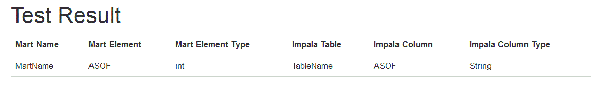

## PAM Data Compare

PAM Data in BA Server is stored in the SqlServer DB, it has his own logic to store the data.
The Original PAM Data is Stored in Impala table and it's easy to get the column name and type.
### 需求分析
BA Server 将mart的信息分布在不同的几张表中，首先需要用sql把表连接起来得到数据。同时，在Mart中，Elements分为Core和非Core。
所谓Core，即在创建Analysis Report的时候，默认使用的字段，而非Core的字段需要先在BA Server界面中额外先添加进来。

所以对比的时候最外层有两种逻辑，即对比Core和非Core的字段。

e.g. for mart MART_A

那么当比较非Core的时候，BAServer得mart名字即为`MART_A`，而字段的标记为`!Core`, 而Implala的表名为`MART_A`

当比较Core的时候，BAServer的mart仍为`MART_A`,字段标记isCore为`True`, 而Impala的表名要改为`MART_A_CORE`.

main sql used as below：为了解耦，我将主要的长sql语句写在了独立的文件中，通过XMLUtil来读取，进而在DAO中使用。

>src/main/resources/query_sqlserver.xml
```xml
<?xml version="1.0" encoding="UTF-8"?>
<queries>
	<query id="1" name="getElementByMartID">
        <![CDATA[
			select 
			M.id martID, 
			M.physical_name martName,
			MV.id martVersionId,
			ME.id martElementID,
			ME.physical_name martElementName,
			ME.type martElementType,
			ME.business_view_id businessID,
			BV.display_name businessName,
			BV.isCore isCore
			from tblMartVersion MV, tblMart M, tblMartElement ME, tblBusinessView BV 
			where m.id = MV.mart_id and MV.mart_id = ME.mart_version_id 
			and ME.business_view_id = BV.id
			and M.id = %s
        ]]>
	</query>
</queries>
```
而PAM这边就比较简单，直接取得Column的名字(Name)和类型(Type)就行：
>src/main/resources/query_impala.xml
```xml
<?xml version="1.0" encoding="UTF-8"?>
<queries>
	<query id="1" name="getColumnInfo">
        <![CDATA[
			describe  %s
        ]]>
	</query>
</queries>
```
### 项目配置
#### Maven配置(有些冗余)

#### Log4J
>src/main/resources/log4j.properties
```properties
# Set root logger level to error
log4j.rootLogger=INFO, Console, File

###### Console appender definition #######

# All outputs currently set to be a ConsoleAppender.
log4j.appender.Console=org.apache.log4j.ConsoleAppender
log4j.appender.Console.layout=org.apache.log4j.PatternLayout
log4j.appender.Console.layout.ConversionPattern=%d{yyyy-MM-dd HH:mm:s} %-5p [%c{3}]:%L %m%n
#log4j.appender.Console.layout.ConversionPattern=%d{ABSOLUTE} %-5p [%c] %m%n

###### File appender definition #######
#log4j.appender.File=org.apache.log4j.DailyRollingFileAppender
log4j.appender.File=org.apache.log4j.RollingFileAppender
log4j.appender.File.File=C:\\logging.log
#log4j.appender.File.File=spring.log
log4j.appender.File.Append=true
log4j.appender.File.MaxFileSize=10MB
log4j.appender.File.MaxBackupIndex=10
log4j.appender.File.layout=org.apache.log4j.PatternLayout
log4j.appender.File.layout.ConversionPattern=%d{yyyy-MM-dd HH:mm:s} %-5p [%c] %m%n

```
#### 数据库信息配置
DBInfo.properties存储的是数据库的信息，由FileConfig.java读取这部分信息，并在代码中使用
```ini
impala.datasource1.url=jdbc:impala://ServerName:21050/metldw595d;SSL=1;CAIssuedCertNamesMismatch=1;SSLTrustStore=C:/ProgramDev/jdk1.7.0_51_64bit/jre/lib/security/cacerts;SSLTrustStorePwd=changeit;AuthMech=1;KrbServiceName=impala;KrbAuthType=1;KrbRealm=CURNX.COM;KrbHostFQDN=ServerName;

impala.datasource1.username=
impala.datasource1.password=
impala.datasource1.driverClassName=com.cloudera.impala.jdbc41.Driver


sqlserver.datasource1.url=jdbc:sqlserver://Server:1433;DatabaseName=DB1
sqlserver.datasource1.username=username
sqlserver.datasource1.password=password
sqlserver.datasource1.driverClassName=com.microsoft.sqlserver.jdbc.SQLServerDriver

sqlserver.datasource2.url=jdbc:sqlserver://Server:1433;DatabaseName=DB2
sqlserver.datasource2.username=username
sqlserver.datasource2.password=password
sqlserver.datasource2.driverClassName=com.microsoft.sqlserver.jdbc.SQLServerDriver

java.security.auth.login.config=C:/ProgramDev/jdk1.7.0_51_64bit/jre/lib/security/jaas.conf
java.security.krb5.conf=C:/ProgramDev/jdk1.7.0_51_64bit/jre/lib/security/krb5.conf
```

### 主要对比过程
#### 只比较名字
因为基本上两边的类型都是Expected的，但是在数值上确实不一致的(e.g. Month(int in BAServer, string in impala))，为了方便，就只比较名字，这样就相对更简单了。
当然我当时也设计了另外一个思路，即把一些特殊情况单独罗列配置，这样更灵活.

为了区分两边数据，我将BAServer这边的字段信息称为Element,Impala这边取名为Column。

因为是以BAServer这边为基准，所以先取出其所有信息，之后再遍历，从Impala这边取得对应的值，再进行比较。
```java
public void compareAllMartAllElementsNameOnly() {
    openConnections();
    List<Mart> martList = sqlServerDAO.getAllMarts();
    for (Mart mart : martList) {
        System.out.println("@" + mart.getName());
        mart.setMappedTableName(mart.getName());
        List<Element> elementsAll = mart.getElements();
        List<Column> columnsAll = impalaDAO.getColumnsByTableName(mart.getName());
        compareMartImpalaListNameOnly(mart, elementsAll, columnsAll);
    }
    closeConnections();
}
```
#### 对比两个List中的数据
直接对比的话还是简单的，但是因为BA Server这边有重复数据的可能性（相同字段名字，但是不一样的类型，做特殊处理）,所以需要特殊标记
```java
public void compareMartImpalaListNameOnly(Mart mart, List<Element> elementList, List<Column> columns) {
    List<Element> elemntsNotMatched = new ArrayList<Element>();
    Map<Element, Column> typeNotMatchedMap = new HashMap<Element, Column>();

    TestResultMart testResultMart = new TestResultMart();
    testResultMart.setMartName(mart.getName());
    testResultMart.setTableName(mart.getMappedTableName());
    System.out.println("Mart:" + testResultMart.getMartName() + ":" + elementList.size());
    System.out.println("Impala:" + testResultMart.getTableName() + ":" + columns.size());
    //precheck if there is the name matched or not
    Map<String, Boolean> haveMatchedMap = haveMatchedColumnNameOnlyMap(elementList, columns);
    for (Element element : elementList) {
        Boolean matched = false;
        //precheck there is repeat elements in BAServer DB 
        Boolean repeated = (countElementNameRepeatTimes(element, elementList) > 1)
                && (haveMatchedMap.get(element.getName()) != null);
        
        for (Column column : columns) {
            Boolean nameMatched = elementColumnNameMatched(element, column);
            if (nameMatched) {
                matched = true;
                if (repeated && !elementColumnTypeMatched(element, column)) {
                    // if repeated and type not match, it means maybe another one will match, so make the flag as false
                    matched = false;
                } else {
                    //means matched and remove the column from the impala list.
                    columns.remove(column);
                }
                break;
            }
        }
        
        if (!matched) {
            if (repeated) {
                //not matched but have repeated element, so mark it with new name with (Repeated)
                element.setName(element.getName() + "(Repeated)");
                if (showRepeated) {
                    elemntsNotMatched.add(element);
                }
            } else {
                elemntsNotMatched.add(element);
            }
        }
    }
    //Remove the ignored compared Elements
    getIgnoredElements();
    List<Element> elemntsNotMatchedFinal = new ArrayList<Element>();
    for (Element notMatchedET : elemntsNotMatched) {
        boolean isIgnored = false;
        for (Element ignoredElement : ignoredElements) {
            if (strEquals(notMatchedET.getName(), ignoredElement.getName())
                    && strEquals(notMatchedET.getType(), ignoredElement.getType())) {
                isIgnored = true;
                break;
            }
        }
        if (!isIgnored) {
            elemntsNotMatchedFinal.add(notMatchedET);
        }
    }

    testResultMart.setNotMatchedElement(elemntsNotMatchedFinal);
    testResultMart.setNotMatchedColumns(columns);
    testResultMart.setNotMatchedTypeMap(typeNotMatchedMap);
    //put the result to the testResult object
    testResult.getTestResultMartList().add(testResultMart);
}
```
#### 对比Name和Type
其实这个方法和上面的可以结合在一起，有许多重复的代码，但当时为了方便，逻辑清楚些，就分开两个方法先用着
```java
public void compareMartImpalaList(Mart mart, List<Element> elementList, List<Column> columns) {
    List<Element> elemntsNotMatched = new ArrayList<Element>();
    Map<Element, Column> typeNotMatchedMap = new HashMap<Element, Column>();

    TestResultMart testResultMart = new TestResultMart();
    testResultMart.setMartName(mart.getName());
    testResultMart.setTableName(mart.getMappedTableName());
    System.out.println("Mart:" + testResultMart.getMartName() + ":" + elementList.size());
    System.out.println("Impala:" + testResultMart.getTableName() + ":" + columns.size());
    Map<String, Boolean> haveMatchedMap = haveMatchedColumnMap(elementList, columns);
    for (Element element : elementList) {
        Boolean matched = false;
        Boolean repeated = (countElementNameRepeatTimes(element, elementList) > 1)
                && (haveMatchedMap.get(element.getName()) != null);
        
        for (Column column : columns) {
            Boolean nameMatched = elementColumnNameMatched(element, column);
            Boolean typeMatched = elementColumnTypeMatched(element, column);
            
            if (nameMatched) {
                matched = true;
                Boolean haveAllMatched = haveAllMatchedColumn(column, elementList);
                if(typeMatched){
                    columns.remove(column);
                }else if(!haveAllMatched){
                    typeNotMatchedMap.put(element, column);
                    columns.remove(column);
                }else{
                    matched = false;
                }
                break;
            }
        }
        if (!matched) {
            if (repeated) {
                element.setName(element.getName() + "(Repeated)");
                if (showRepeated) {
                    elemntsNotMatched.add(element);
                }
            } else {
                elemntsNotMatched.add(element);
            }
        }
    }

    getIgnoredElements();
    List<Element> elemntsNotMatchedFinal = new ArrayList<Element>();
    for (Element notMatchedET : elemntsNotMatched) {
        boolean isIgnored = false;
        for (Element ignoredElement : ignoredElements) {
            if (strEquals(notMatchedET.getName(), ignoredElement.getName())
                    && strEquals(notMatchedET.getType(), ignoredElement.getType())) {
                isIgnored = true;
                break;
            }
        }

        if (!isIgnored) {
            elemntsNotMatchedFinal.add(notMatchedET);
        }
    }

    testResultMart.setNotMatchedElement(elemntsNotMatchedFinal);
    testResultMart.setNotMatchedColumns(columns);
    testResultMart.setNotMatchedTypeMap(typeNotMatchedMap);
    testResult.getTestResultMartList().add(testResultMart);
}
```
### 输出结果
#### 输出结果至html文件中
这一块我有设想写成一个丰富的模块，将标准结果集以良好的格式输出，暂时就先HardCode吧:smile:

下面这个方法就是将结果写入一个Template.html中，并根据Mart的名字依次生成。
```java
public static void writeResultToFiles(TestResult testResult, String suffix) throws IOException {
    
    URL url = TestUtils.class.getClassLoader().getResource("Template.html");
            //.getResourceAsStream("Template.html").
    //URL url = new PathMatchingResourcePatternResolver().getResource("file:./Template.html").getURL();
    File htmlTemplateFile = new File(url.getPath());
    // File htmlTemplateFile = new File("./Template.html");

    String tableStr = "";
    String htmlTemplate = FileUtils.readFileToString(htmlTemplateFile, Charsets.toCharset("UTF-8"));
    String contentTemplate = "<tr><td>%s</td><td>%s</td><td class='elementType'>%s</td><td>%s</td><td>%s</td><td class='columnType'>%s</td></tr>";

    for (TestResultMart trm : testResult.getTestResultMartList()) {
        int notMatchedEltNum = trm.getNotMatchedElement().size();
        int notMatchedColNum = trm.getNotMatchedColumns().size();

        Map<Element, Column> map = trm.getNotMatchedTypeMap();

        boolean flag1 = notMatchedEltNum > 0;
        boolean flag2 = !map.isEmpty();
        boolean flag3 = notMatchedColNum > 0 && trm.getTableName().contains("CORE");
        if (flag1 || flag2 || flag3) {
            for (Element element : trm.getNotMatchedElement()) {
                tableStr += String.format(contentTemplate, trm.getMartName(), element.getName(), element.getType(),
                        trm.getTableName(), "", "");
            }
            if (trm.getTableName().contains("CORE")) {
                for (Column column : trm.getNotMatchedColumns()) {
                    tableStr += String.format(contentTemplate, trm.getMartName(), "", "", trm.getTableName(),
                            column.getName(), column.getType());
                }
            }

            for (Element key : map.keySet()) {
                tableStr += String.format(contentTemplate, trm.getMartName(), key.getName(), key.getType(),
                        trm.getTableName(),
                        map.get(key).getIsCore() ? map.get(key).getName() + "(CORE)" : map.get(key).getName(),
                        map.get(key).getType());
            }

            String htmlOut = replaceContent(htmlTemplate, "resultItem", tableStr);
           
            String fileName = trm.getMartName() + suffix + ".html";

            FileUtils.writeStringToFile(new File("TestResult/" + fileName), htmlOut,
                    Charsets.toCharset("UTF-8"));

            tableStr = "";
        }
    }

    testResult.getTestResultMartList().clear();

    // Desktop.getDesktop().browse(URI.create("Result.html"));

}
```
#### 输出报表样例
以下是输出的HTMLSample:

